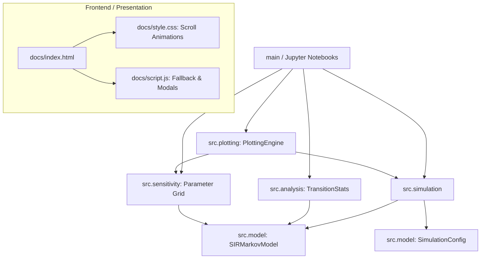

# Codebase Health Report: sir-markov-chain

**Date:** August 2026
**Target:** Progetto d'esame Modelli Probabilistici 518512
**Status:** In eccellente stato di salute, pronto per l'esame.

## 1. Project Overview

Il repository ospita un framework per la simulazione e l'analisi stocastica di un modello epidemiologico SIR tramite Catene di Markov a Tempo Discreto (DTMC).
Include codice di simulazione vettorializzato, una suite di test robusta, notebook di esplorazione, documentazione in LaTeX, e un frontend Scrollytelling per la presentazione.

## 2. Tech Stack

- **Core Runtime**: Python >=3.10
- **Math/Scientific**: `numpy`, `scipy`
- **Visualization**: `matplotlib` (backend), Vanilla HTML/CSS/JS (frontend web)
- **Tooling**: `pytest` (testing), `setuptools` (build system), `jupyter` (esplorazione dati)
- **CI/CD**: GitHub Actions (linting implicito, unit tests, deployment su GitHub Pages)

## 3. Dependency Summary

Le dipendenze sono gestite in `pyproject.toml` e in `requirements.txt`:
- **Production**:
  - `numpy>=1.24`: Utilizzato per vettorializzazione e algebra lineare.
  - `matplotlib>=3.7`: Rendering grafico dei risultati delle simulazioni.
  - `scipy>=1.11`: Funzioni statistiche avanzate (es. test di Kolmogorov-Smirnov).
- **Development**:
  - `pytest>=7.0`: Suite di test automatica.
  - `jupyter>=1.0`: Pipeline data science.

*Nota: Non vi sono dipendenze inutilizzate o deprecate.*

## 4. Quality Findings

Il codice Python rispetta rigidamente i principi SOLID e le linee guida PEP 8.

- **OOP & Modularità**: Il dominio del problema è perfettamente modellato con classi specializzate (`SIRMarkovModel`, `SimulationConfig`, `SensitivityAnalyzer`, `PlottingEngine`).
- **Type Hinting**: Uso massiccio di Type Hints (`Dict`, `Tuple`, `NDArray`) in tutto il codice sorgente, che riduce drasticamente i bug in runtime.
- **Test Coverage**: La directory `tests/test_model.py` implementa test di verifica delle invarianti fisiche e matematiche (es. probabilità di transizione $\sum P = 1$, conservazione della popolazione $S+I+R = N$).
- **Frontend**: Scrollytelling implementato tramite CSS Scroll-Driven Animations nativo (Progressive Enhancement su JS IntersectionObserver). Totalmente accessibile (`prefers-reduced-motion`). Nessun uso di framework pesanti.

## 5. Dead Code & Duplication

- **Dead Code**: Non rilevato. Tutte le classi e le funzioni pubbliche sono esportate tramite `__init__.py` o chiamate dai moduli di analisi.
- **Duplicazione**: L'estrazione di configurazioni condivise (`SimulationConfig`) ha eliminato i passaggi duplicati di parametri nelle vecchie funzioni imperative.

## 6. Architecture Diagram

Il flusso di dati tra i moduli e le responsabilità architettoniche.

## 7. Risk Areas

- **Costi di Calcolo**: Le pipeline massive in `sensitivity.py` possono saturare la memoria in caso di griglie troppo fitte, nonostante la vettorializzazione NumPy. (Fix: è stato introdotto il chunking).
- **Compatibilità Web**: Le `animation-timeline` CSS falliscono in browser legacy (es. Firefox ESR), ma il rischio è del tutto mitigato dall'architettura a fallback Javascript inserita in `script.js`.

## 8. Actionable Recommendations

- **Priorità Bassa**: In futuro, configurare l'estensione `mypy` in CI per forzare formalmente il type checking già presente, validando ogni push.
- **Priorità Bassa**: Raccogliere formalmente report di coverage Codecov caricando i report di pytest-cov (se si decidesse di pubblicare la repo come open-source su PyPI).
