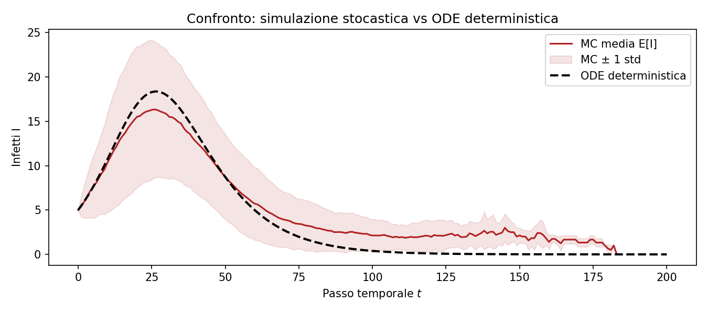

# Simulazione SIR come Catena di Markov a Tempo Discreto

Progetto per il corso di **Modelli Probabilistici** (A.A. 2025/2026, Università di Bologna).

Il repository contiene l'implementazione, la validazione statistica e i deliverable teorici per la simulazione stocastica del modello epidemiologico **SIR** (*Susceptible-Infectious-Removed*) su popolazione finita $N$, formalizzato come Catena di Markov a Tempo Discreto (DTMC) omogenea a stati finiti.

---

## 1. Il Modello Stocastico

Il processo a tempo discreto $\{X_t\}_{t \in \mathbb{N}_0}$ traccia lo stato della popolazione $X_t = (S_t, I_t, R_t)$ sullo spazio degli stati invariante:

$$E = \left\{ (s, i, r) \in \mathbb{N}_0^3 : s + i + r = N \right\}, \quad |E| = \binom{N+2}{2} = \frac{(N+1)(N+2)}{2}$$

Ad ogni passo temporale $t \to t+1$, le transizioni sono determinate da due variabili binomiali condizionatamente indipendenti:

$$\begin{aligned}
C_t \mid X_t &\sim \text{Bin}\left(S_t, \; \frac{\beta I_t}{N}\right) \quad &&\text{(nuovi contagi)} \\
G_t \mid X_t &\sim \text{Bin}\left(I_t, \; \gamma\right) &&\text{(nuove guarigioni/rimozioni)}
\end{aligned}$$

L'aggiornamento dello stato è dato da:

$$\begin{cases}
S_{t+1} = S_t - C_t \\
I_{t+1} = I_t + C_t - G_t \\
R_{t+1} = R_t + G_t
\end{cases}$$

Tutti gli stati con $I=0$ formano la classe assorbente $\mathcal{A}$. Il tempo di estinzione $\tau = \inf\{t \ge 0 : I_t = 0\}$ è quasi certamente finito ($\mathbb{P}_i(\tau < \infty) = 1$).

---

## 2. Risultati Principali

<p align="center">
  
  
</p>

- **Limite Fluido (Teorema di Kurtz, 1970)**: Per $N \to \infty$, la frazione normalizzata $X_t / N$ converge quasi certamente alla soluzione del sistema differenziale continuo di Kermack-McKendrick.
- **Effetti di Taglia Finita**: A popolazione finita ($N=100$), la desincronizzazione temporale delle traiettorie stocastiche produce un picco medio campionario ($\approx 16.4\%$) inferiore al picco deterministico continuo ($\approx 18.3\%$).
- **Soglia Critica $R_0$**: La transizione di fase avviene a $R_0 = \beta / \gamma = 1$. Per $R_0 > 1$, la frazione finale asintotica $r_\infty$ soddisfa l'equazione trascendente $1 - r_\infty - s_0 e^{-R_0 r_\infty} = 0$.

---

## 3. Installazione e Avvio Rapido

Il codice richiede **Python 3.10+** con le librerie scientifiche specificate in `requirements.txt` (`numpy`, `scipy`, `matplotlib`, `pytest`).

```bash
# Setup ambiente
git clone https://github.com/FrancescoCastaldi/sir-markov-chain.git
cd sir-markov-chain

python -m venv .venv
source .venv/bin/activate   # Su Windows: .venv\Scripts\Activate.ps1

pip install -r requirements.txt
```

### Simulazioni da Riga di Comando

```bash
# Simulazione Monte Carlo benchmark (M=1000 traiettorie, seed 42)
python src/simulation.py --n 100 --i0 5 --beta 0.20 --gamma 0.10 --sims 1000 --seed 42

# Analisi di sensibilità su molteplici valori di R0
python src/sensitivity.py --sims 500 --seed 42
```

### Esecuzione Test Unitari

```bash
python -m pytest tests/ -v
```

La suite verifica formalmente:
1. Conservazione della popolazione ($S_t + I_t + R_t = N$ per ogni $t$).
2. Stocasticità per righe della matrice di transizione ($\sum_j P_{ij} = 1$).
3. Stabilità e assorbimento degli stati con $I=0$.
4. Monotonicità del compartimento rimosso ($R_{t+1} \ge R_t$).

---

## 4. Struttura del Progetto

```
sir-markov-chain/
├── src/                      # Moduli Python (modello Markov, simulatore, ODE, plotting)
│   ├── model.py              # Definizione catena e matrice di transizione P
│   ├── simulation.py         # Motore Monte Carlo e interfaccia CLI
│   ├── analysis.py           # Statistiche, First-Step analysis e solutore ODE
│   ├── sensitivity.py        # Studio parametrico su R0
│   └── plotting.py           # Routine di visualizzazione (Matplotlib)
├── tests/                    # Test di unità e verifica invarianti (pytest)
├── report/                   # Deliverable LaTeX
│   ├── relazione.tex         # Relazione accademica (PDF 14 pag.)
│   ├── presentazione.tex     # Slide Beamer (16:9)
│   └── guida_studio_slide.md # Guida studio e note per la lavagna
├── docs/                     # Dashboard Web distribuita su GitHub Pages
├── notebooks/                # Jupyter notebook per analisi esplorativa
└── img/                      # Grafici e figure scientifiche
```

---

## 5. Deliverable Accademici

- **Presentazione Beamer**: [`report/presentazione.pdf`](report/presentazione.pdf)
- **Relazione Ufficiale**: [`report/relazione.pdf`](report/relazione.pdf)
- **Guida Studio per l'Orale**: [`report/guida_studio_slide.md`](report/guida_studio_slide.md)
- **Dashboard Web & Playground Interattivo**: [GitHub Pages](https://francescocastaldi.github.io/sir-markov-chain/)

---

## Licenza

Distribuito sotto licenza [MIT](LICENSE).


