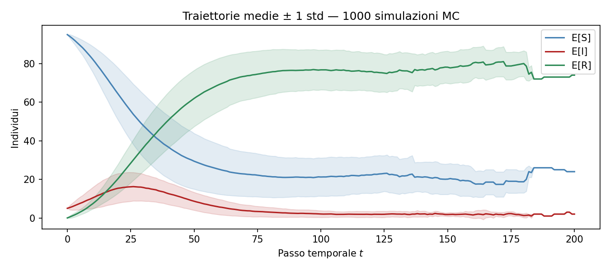

<p align="center">
  
</p>

<h1 align="center">🦠 SIR Markov Chain Simulator: A Stochastic Epidemic Model</h1>

<p align="center">
  <em>Una simulazione stocastica avanzata, interamente parametrizzabile, di un'epidemia SIR (Suscettibili, Infetti, Rimossi) modellata rigorosamente come Catena di Markov a tempo discreto su una popolazione finita, supportata da dashboard web e analisi matematiche.</em>
</p>

<p align="center">
  
  
  
  
  
</p>

---

## 📖 Indice dei Contenuti
1. [Introduzione e Contesto Teorico](#1-introduzione-e-contesto-teorico)
2. [Caratteristiche Architetturali](#2-caratteristiche-architetturali)
3. [Struttura della Repository](#3-struttura-della-repository)
4. [Motore Matematico e Invarianti](#4-motore-matematico-e-invarianti)
5. [Installazione e Setup Locale](#5-installazione-e-setup-locale)
6. [Guida all'Uso e Interfaccia CLI](#6-guida-alluso-e-interfaccia-cli)
7. [Visualizzazioni e Modulo Web](#7-visualizzazioni-e-modulo-web)
8. [Note di Sviluppo Avanzate](#8-note-di-sviluppo-avanzate)

---

## 1. Introduzione e Contesto Teorico

Questo progetto nasce all'interno del corso accademico di **Modelli Probabilistici** (Università di Bologna) con l'obiettivo di tradurre la teoria dei processi stocastici e delle Catene di Markov in un'implementazione software robusta, scalabile e riproducibile.

A differenza del classico modello compartimentale SIR deterministico risolto tramite equazioni differenziali ordinarie (es. Kermack-McKendrick), questo simulatore affronta il problema sotto l'esclusiva lente della probabilità. Il sistema è definito da uno spazio degli stati finito $E = \{(s,i,r) \in \mathbb{N}^3 : s+i+r = N\}$ e da una matrice di transizione di Markov generata dinamicamente tramite estrazioni da distribuzioni Binomiali. Questo approccio permette di osservare le fluttuazioni stocastiche endogene dell'epidemia e le probabilità di assorbimento (termine epidemia).

## 2. Caratteristiche Architetturali

- 🎲 **Motore Stocastico Puro**: La probabilità di transizione da uno stato all'altro è calcolata rigorosamente, senza approssimazioni temporali scorrette, usando `np.random.binomial`.
- 📈 **Aggregazione Monte Carlo Tensoriale**: Simulazioni massive indipendenti ($M=1000$ o più) eseguite in parallelo per calcolare media, deviazione standard, e intervalli di confidenza delle traiettorie.
- 🔬 **Sensitivity Analysis Parametrizzata**: Automazione per la derivazione della sensibilità del modello rispetto al parametro $R_0 = \frac{\beta}{\gamma}$, cruciale per la comprensione del picco epidemico.
- 📉 **Hybrid Validation (Stocastico vs ODE)**: Verifica cruzata matematica includendo un solutore Eulero esplicito del sistema SIR per validare il limite $N \to \infty$ del modello stocastico rispetto alle sue controparti continue.
- 🌐 **Ecosistema Completo**: Dal codice Python puramente algoritmico, a suite di Unit Test, a pipeline Jupyter interattive, fino a una Dashboard Web in Vanilla CSS (Glassmorphism) e i deliverable accademici in LaTeX.

## 3. Struttura della Repository

Ogni modulo del progetto è documentato nel dettaglio. Esplora le directory sottostanti per leggere l'analisi approfondita di ogni componente:

| Directory | Ruolo nel Sistema | Leggi la documentazione |
|-----------|------------------|-------------------------|
| `src/` | 🧠 **Core Matematico**: Contiene la logica Markoviana, il runner Monte Carlo, gli analizzatori statistici e le direttive di plot Matplotlib. | [👉 Docs `src/`](src/README.md) |
| `tests/` | 🧪 **Quality Assurance**: Unit test `pytest` che validano matematicamente la conservazione della massa, positività e stati assorbenti. | [👉 Docs `tests/`](tests/README.md) |
| `notebooks/`| 📓 **Interactive EDA**: Pipeline Jupyter ideali per la prototipazione esplorativa e lo studio live del modello. | [👉 Docs `notebooks/`](notebooks/README.md) |
| `docs/` | 🌐 **Web Dashboard**: Piattaforma web estetica in Vanilla CSS/JS ospitata via GitHub Pages. Nessun framework pesante, puro Glassmorphism. | [👉 Docs `docs/`](docs/README.md) |
| `report/` | 📄 **Accademia**: Sorgenti LaTeX, Slide Beamer e dispensari per l'esame. | [👉 Docs `report/`](report/README.md) |
| `img/` | 📊 **Dati Visivi**: Artefatti PNG high-dpi generati dal modello. | [👉 Docs `img/`](img/README.md) |

## 4. Motore Matematico e Invarianti

L'implementazione garantisce sempre il rispetto delle leggi fondamentali di conservazione:

1. **Popolazione Chiusa**: $S_t + I_t + R_t = N$ per ogni $t \ge 0$. Non si considerano dinamiche vitali (nascite/morti).
2. **Proprietà di Markov**: La transizione allo stato $(S_{t+1}, I_{t+1}, R_{t+1})$ dipende *esclusivamente* dallo stato $(S_t, I_t, R_t)$ al tempo $t$, rendendo il processo privo di memoria a lungo termine.
3. **Stati Assorbenti**: Qualsiasi stato della forma $(s, 0, N-s)$ (ovvero zero infetti) è **assorbente**. La probabilità di abbandonare questo stato è matematicamente $0$. Il sistema garantisce che la simulazione si arresti (o rimanga fissa) una volta soddisfatta la condizione.

## 5. Installazione e Setup Locale

Per eseguire le simulazioni sulla propria macchina, il progetto richiede Python 3.10 o superiore. Il gestore di pacchetti raccomandato è `pip`.

```bash
# 1. Clona il repository in locale
git clone https://github.com/FrancescoCastaldi/sir-markov-chain.git
cd sir-markov-chain

# 2. (Opzionale ma consigliato) Crea un ambiente virtuale
python -m venv .venv
source .venv/bin/activate  # Su Windows: .venv\Scripts\activate

# 3. Installa le dipendenze scientifiche (numpy, scipy, matplotlib, pytest)
pip install -r requirements.txt
```

## 6. Guida all'Uso e Interfaccia CLI

Il progetto espone i suoi motori stocastici tramite interfacce a linea di comando (CLI) estremamente modulari gestite via `argparse`.

### 6.1. Simulazione Standard (Monte Carlo Aggregato)
Per eseguire un run Monte Carlo, estraendo $1000$ epidemie differenti e mediando i risultati (producendo anche grafici su intervalli di deviazione standard e tempo finale):
```bash
python src/simulation.py --n 100 --i0 5 --beta 0.2 --gamma 0.1 --sims 1000 --seed 42
```
*I grafici generati verranno salvati in `/img/mean_trajectory.png`, `/img/single_trajectory.png`, ecc.*

### 6.2. Analisi di Sensibilità (Impatto di R_0)
Per studiare l'effetto di diversi rapporti $\beta/\gamma$ e come questi alterino il picco epidemico e la velocità di assorbimento:
```bash
python src/sensitivity.py --sims 500 --seed 42
```
*Questo script sovrascriverà `/img/sensitivity_comparison.png` con una mesh multi-dimensionale di andamenti al variare del tasso di infettività.*

### 6.3. Validazione Test Rigorosi
Il progetto integra una suite di regressione. Si consiglia vivamente di eseguirla prima di fare commit su qualsiasi modifica logica:
```bash
python -m pytest tests/ -v
```

## 7. Visualizzazioni e Modulo Web

I risultati non si fermano al formato CLI. L'esposizione del progetto avviene tramite una Landing Page interattiva generata nativamente. Il repository è integrato con **GitHub Actions** che intercetta i push su `master`, preleva la cartella `/docs/` e ne fa il deploy direttamente sul dominio GitHub Pages del progetto, rendendo la visualizzazione fruibile universalmente senza setup.

## 8. Note di Sviluppo Avanzate

> [!CAUTION]
> Lo spazio degli stati complessivo di questo sistema scala in maniera combinatoria come $\frac{(N+1)(N+2)}{2}$. Per la popolazione target dell'esame ($N=100$), questo produce **5.151 stati**. Il salvataggio in RAM dell'intera Matrice di Transizione esatta comporterebbe un array da $5151 \times 5151 \approx 26.5 \times 10^6$ celle in virgola mobile, rendendo i calcoli esatti con algebra lineare estremamente costosi. Pertanto, **il sistema non istanzia mai la matrice stocastica intera in memoria** se non espressamente richiesto per debug (fino a $N=6$), e si appoggia interamente sull'estrazione empirica Monte Carlo (forward trajectory mapping).

> [!NOTE]
> La riproducibilità è un pilastro della scienza dei dati. Passare l'argomento `--seed X` ai moduli CLI non imposta solo il seed di `numpy`, ma propaga l'entropia deterministica all'intera catena di invocazioni interne. Si raccomanda di utilizzare `42` per permettere la generazione di artefatti visivi perfettamente identici a quelli della tesi presentata in LaTeX.
