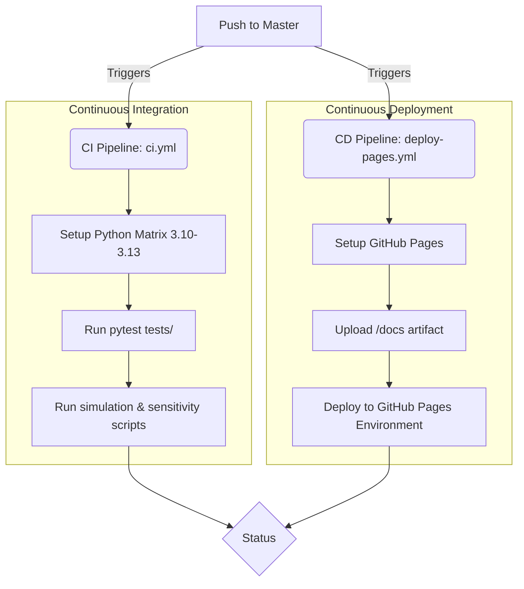

# Web Architecture: SIR Markov Chain

Questo documento descrive l'architettura tecnica del sito web (frontend) progettato per presentare il progetto `sir-markov-chain`.

## 1. Architecture Overview

Il frontend (`docs/`) segue un'architettura **Static Plain HTML / Vanilla JS**.
Non sono stati utilizzati framework pesanti (come React, Next.js, o Vue) per mantenere il bundle size minimo, garantire caricamenti istantanei e minimizzare la complessità infrastrutturale.

- **Struttura Visiva**: La pagina è sviluppata come una presentazione **Scrollytelling**. L'avanzamento verticale del mouse agisce come controller del flusso narrativo, tramite CSS `scroll-snap-type: y mandatory`.
- **Styling**: Vanilla CSS. Utilizzo estensivo di CSS Custom Properties (Variabili) per coerenza tematica ("Deep Space") e moduli moderni.
- **Rendering Scientifico**: Utilizzo di **MathJax** (incluso via CDN) per eseguire il parsing lato client e il rendering perfetto di equazioni LaTeX all'interno dell'HTML.

## 2. Animazioni e Performance (Progressive Enhancement)

Il sistema di animazione utilizza le più moderne Web APIs, applicando il principio di Progressive Enhancement:

- **Browser Moderni (CSS Scroll-Driven Animations)**: Sfrutta `@supports (animation-timeline: scroll())` per legare l'opacità e le traslazioni direttamente alla posizione di scroll, delegando il calcolo al Compositor Thread della GPU a 60fps costanti, senza bloccare il Main Thread.
- **Browser Legacy (JavaScript Fallback)**: Ove la feature non è supportata (es. vecchie versioni Safari o Firefox), l'architettura esegue un gracefully fallback su un pattern basato su `IntersectionObserver` per attivare classi transizionali CSS classiche.
- **Accessibilità (A11Y)**: Supporto nativo per `prefers-reduced-motion: reduce`, per inibire automaticamente il parallax e il fade-in sugli utenti affetti da motion sickness o vertigini.

## 3. Hosting Decision and Rationale

**Provider scelto**: **GitHub Pages**

**Rationale**:
- **Natura del sito**: Essendo un sito puramente statico (HTML/CSS/JS) privo di logica server (SSR) o Edge Functions, GitHub Pages rappresenta l'ecosistema naturale e più efficiente.
- **Integrazione**: Il progetto è già ospitato su GitHub, rendendo Pages l'opzione a zero-attrito.
- **Costi & Prestazioni**: Gratuito, con distribuzione tramite la CDN globale di GitHub.

*(Soluzioni scartate: Vercel / Netlify. Nonostante le eccellenti performance, queste piattaforme eccellono per stack basati su SSR/Edge e framework JS, il cui overhead non è giustificato per questa presentazione accademica).*

## 4. CI/CD Pipeline Diagram

La pipeline CI/CD è interamente definita in GitHub Actions (`.github/workflows/deploy-pages.yml` e `ci.yml`).

## 5. Security and Performance Notes

- **Sicurezza**: Non essendoci input utente (niente form), database o chiamate API esterne, la superficie di attacco (XSS, CSRF, SQLi) è effettivamente nulla.
- **Performance**: Niente build-step JavaScript. Non ci sono chunk, vendor file o bundle Webpack/Vite da scaricare. La UI si inizializza in pochi millisecondi. Le immagini dei plot sono ottimizzate (PNG).
- **SEO**: Meta-tags base applicati, ma essendo una landing interna per l'esame, l'indicizzazione non è la priorità assoluta rispetto alla pulizia del DOM.
