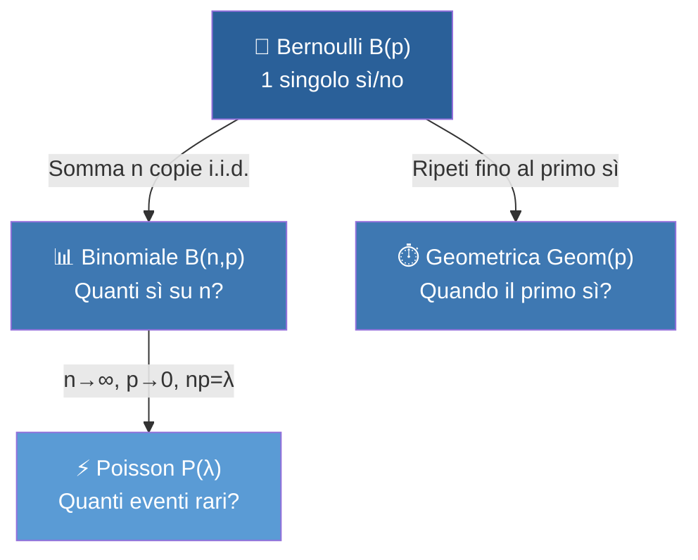

# 🎲 Le 4 Distribuzioni Fondamentali — Guida Studio

> Riferimento: [studio_orale_completo.tex](file:///c:/Users/franc/Documents/sir-markov-chain/references/studio_orale_completo.tex)

---

## 1. Bernoulli — "Esce sì o no?"

> 📖 **Ref:** Capitolo 1, §1.5.2 — [riga 331](file:///c:/Users/franc/Documents/sir-markov-chain/references/studio_orale_completo.tex#L331-L334)

### L'idea in una frase
Hai **un** esperimento con solo due risultati: successo o fallimento.

### La formula
$$X \sim \mathcal{B}(p) \qquad \mathbb{P}(X=1) = p, \quad \mathbb{P}(X=0) = 1-p$$

| | |
|---|---|
| **Media** | $\mathbb{E}[X] = p$ |
| **Varianza** | $\text{Var}(X) = p(1-p)$ |

### Esempi

| Esperimento | Successo ($X=1$) | Fallimento ($X=0$) | $p$ |
|---|---|---|---|
| Lancio moneta equa | Testa | Croce | $0.5$ |
| Tiro libero di Curry | Canestro | Sbagliato | $0.91$ |
| Test COVID di una persona | Positivo | Negativo | dipende... |

### A cosa serve?
È il **mattone base**. Ogni volta che la risposta è sì/no, stai guardando una Bernoulli.

> **Nel SIR:** ogni singolo contatto tra un Suscettibile e un Infetto è una Bernoulli — o ti infetti ($X=1$) o no ($X=0$).

---

## 2. Binomiale — "Quanti successi su $n$ tentativi?"

> 📖 **Ref:** Capitolo 1, §1.5.3 — [riga 336](file:///c:/Users/franc/Documents/sir-markov-chain/references/studio_orale_completo.tex#L336-L344)

### L'idea in una frase
Ripeti lo **stesso** esperimento Bernoulli $n$ volte e conti **quanti** successi ottieni in totale.

### La formula
$$X \sim \mathcal{B}(n,p) \qquad \mathbb{P}(X = k) = \binom{n}{k} \, p^k \, (1-p)^{n-k}$$

Il $\binom{n}{k}$ è il coefficiente binomiale — conta "in quanti ordini diversi" puoi piazzare $k$ successi tra $n$ prove.

| | |
|---|---|
| **Media** | $\mathbb{E}[X] = np$ |
| **Varianza** | $\text{Var}(X) = np(1-p)$ |

### Esempio 1: Monete
> Lancio **10 monete** eque. Quante teste?
> - $n = 10$, $p = 0.5$
> - Media = $10 \times 0.5 = 5$ teste
> - $\mathbb{P}(\text{esattamente 3 teste}) = \binom{10}{3} (0.5)^{10} = \frac{120}{1024} \approx 11.7\%$

### Esempio 2: Esame
> In un corso, ogni studente ha il 70% di probabilità di passare l'esame. Su 30 studenti, quanti passano?
> - $n = 30$, $p = 0.7$
> - Media = $30 \times 0.7 = 21$ studenti
> - $\mathbb{P}(\text{tutti e 30 passano}) = (0.7)^{30} \approx 0.002$ → praticamente impossibile!

### Il trucco chiave (dal .tex, riga 342–344)

> [!TIP]
> **Binomiale = Somma di Bernoulli.** Se $X_1, X_2, \dots, X_n$ sono i.i.d. $\mathcal{B}(p)$, allora $S = X_1 + \cdots + X_n \sim \mathcal{B}(n,p)$.
>
> Questo rende i calcoli facilissimi: $\mathbb{E}[S] = \mathbb{E}[X_1] + \cdots + \mathbb{E}[X_n] = np$ per linearità!

### A cosa serve?
Ogni volta che conti "**quanti** su $n$ fisso":
- Quanti pezzi difettosi in un lotto di 100
- Quanti gol in 5 rigori
- Quanti pazienti guariscono su 20

> **Nel SIR:** al passo $t$, il numero di **nuove infezioni** è $\Delta I \sim \mathcal{B}(S_t, \, p_{\text{inf}})$ — quanti dei $S_t$ suscettibili si infettano?

---

## 3. Geometrica — "Quando arriva il primo successo?"

> 📖 **Ref:** Capitolo 2, §2.3.1 — [riga 474](file:///c:/Users/franc/Documents/sir-markov-chain/references/studio_orale_completo.tex#L474-L491)

### L'idea in una frase
Ripeti un esperimento Bernoulli **finché non vinci**. La Geometrica conta quanti tentativi ti sono serviti.

### La formula
$$T \sim \text{Geom}(p) \qquad \mathbb{P}(T = n) = (1-p)^{n-1} \cdot p, \quad n = 1, 2, 3, \dots$$

> Logica: fallisci $n-1$ volte, poi alla $n$-esima finalmente successo!

| | |
|---|---|
| **Media** | $\mathbb{E}[T] = \dfrac{1}{p}$ |
| **Varianza** | $\text{Var}(T) = \dfrac{1-p}{p^2}$ |

### Esempio 1: Dado
> Lancio un dado finché non esce **6**. Quanti lanci servono?
> - $p = 1/6$
> - $\mathbb{P}(T=1) = 1/6 \approx 17\%$ → "6 al primo colpo"
> - $\mathbb{P}(T=3) = (5/6)^2 \cdot (1/6) \approx 11.6\%$ → "due fallimenti, poi 6"
> - Media = $1/(1/6) = 6$ lanci

### Esempio 2: Colloquio di lavoro
> Un candidato ha il 20% di probabilità di superare ogni colloquio. In media quanti ne deve fare?
> - $p = 0.2$
> - Media = $1/0.2 = 5$ colloqui

### La proprietà bomba: ASSENZA DI MEMORIA

> 📖 **Ref:** [riga 484–491](file:///c:/Users/franc/Documents/sir-markov-chain/references/studio_orale_completo.tex#L484-L491)

$$\mathbb{P}(T > n+k \mid T > n) = \mathbb{P}(T > k)$$

**Cosa vuol dire in pratica?** Se stai lanciando un dado e sono 50 lanci che non esce 6, la probabilità di dover aspettare **ancora** 3 lanci è **identica** a quella che avevi all'inizio. Il dado non "ricorda" i lanci passati!

> [!IMPORTANT]
> La Geometrica è l'**unica** distribuzione discreta con questa proprietà. All'esame è un fatto che piace chiedere!

### A cosa serve?
Modella **tempi di attesa** per eventi casuali:
- Quanti tentativi prima di vincere alla lotteria
- Quanti clienti prima del primo acquisto
- Quanti giorni prima che piova

> **Nel SIR:** il tempo di guarigione di un singolo infetto. Se ad ogni passo ha probabilità $\gamma$ di guarire, il numero di passi che resta infetto è $T \sim \text{Geom}(\gamma)$, con media $1/\gamma$.

---

## 4. Poisson — "Quanti eventi rari in un intervallo?"

> 📖 **Ref:** Capitolo 2, §2.2.1 — [riga 451](file:///c:/Users/franc/Documents/sir-markov-chain/references/studio_orale_completo.tex#L451-L462)

### L'idea in una frase
Conta quanti **eventi rari e indipendenti** accadono in un periodo fisso, sapendo che il tasso medio è $\lambda$.

### La formula
$$X \sim \mathcal{P}(\lambda) \qquad \mathbb{P}(X = k) = e^{-\lambda} \frac{\lambda^k}{k!}, \quad k = 0, 1, 2, \dots$$

| | |
|---|---|
| **Media** | $\mathbb{E}[X] = \lambda$ |
| **Varianza** | $\text{Var}(X) = \lambda$ |

> [!NOTE]
> **Media = Varianza!** Se nei tuoi dati la media è circa uguale alla varianza, probabilmente stai guardando una Poisson.

### Esempio 1: Call center
> Un call center riceve in media $\lambda = 4$ chiamate all'ora.
> - $\mathbb{P}(\text{0 chiamate}) = e^{-4} \approx 1.8\%$ → raro ma possibile
> - $\mathbb{P}(\text{esattamente 4}) = e^{-4} \frac{256}{24} \approx 19.5\%$
> - $\mathbb{P}(\text{10 o più}) \approx 0.8\%$ → quasi mai

### Esempio 2: Errori di battitura
> Una pagina ha in media $\lambda = 2$ errori. Qual è la probabilità di 0 errori?
> $$\mathbb{P}(X=0) = e^{-2} \approx 13.5\%$$

### Il ponte con la Binomiale (Teorema di Poisson)

Quando hai **tanti** esperimenti ($n$ grande) con probabilità di successo **piccola** ($p$ piccolo), la Binomiale si comporta come una Poisson con $\lambda = np$:

$$\mathcal{B}(n, p) \approx \mathcal{P}(\lambda = np) \qquad \text{quando } n \to \infty, \; p \to 0, \; np = \lambda$$

**Esempio pratico:** In una città di 100.000 abitanti, ogni persona ha probabilità $p = 0.00003$ di avere un incidente oggi.
- Binomiale esatta: $\mathcal{B}(100000, \, 0.00003)$ → calcolo impossibile!
- Approssimazione Poisson: $\mathcal{P}(3)$ → calcolo facilissimo!

### Proprietà utile (dal .tex, riga 460–462)

> [!TIP]
> **Somma di Poisson:** se $X \sim \mathcal{P}(\lambda_1)$ e $Y \sim \mathcal{P}(\lambda_2)$ indipendenti, allora $X + Y \sim \mathcal{P}(\lambda_1 + \lambda_2)$.

### A cosa serve?
Eventi **rari** su **grandi numeri**:
- Decadimenti radioattivi al minuto
- Richieste a un server per secondo
- Mutazioni genetiche per generazione

> **Nel SIR con $N$ grande:** quando la popolazione è enorme e la probabilità di infezione per singolo contatto è piccola, il numero di nuove infezioni si approssima con $\mathcal{P}(\beta S I / N)$.

---

## Tabella Riepilogativa

| Distribuzione | **Domanda** | Supporto | Media | Varianza |
|---|---|---|---|---|
| **Bernoulli** $\mathcal{B}(p)$ | "Sì o no?" | $\{0, 1\}$ | $p$ | $p(1-p)$ |
| **Binomiale** $\mathcal{B}(n,p)$ | "Quanti sì su $n$?" | $\{0, \dots, n\}$ | $np$ | $np(1-p)$ |
| **Geometrica** $\text{Geom}(p)$ | "Quando il primo sì?" | $\{1, 2, 3, \dots\}$ | $1/p$ | $(1-p)/p^2$ |
| **Poisson** $\mathcal{P}(\lambda)$ | "Quanti eventi rari?" | $\{0, 1, 2, \dots\}$ | $\lambda$ | $\lambda$ |

---

## Come sono collegate

> **Regola per l'esame**: ti danno un problema, chiediti:
> 1. È un singolo sì/no? → **Bernoulli**
> 2. Conto successi su $n$ fisso? → **Binomiale**
> 3. Aspetto il primo successo? → **Geometrica**
> 4. Conto eventi rari su un intervallo? → **Poisson**

---

## Dove trovarle nel .tex

| Distribuzione | Capitolo | Sezione | Righe |
|---|---|---|---|
| Bernoulli | Cap. 1 — Spazi finiti | §1.5.2 | [331–334](file:///c:/Users/franc/Documents/sir-markov-chain/references/studio_orale_completo.tex#L331-L334) |
| Binomiale | Cap. 1 — Spazi finiti | §1.5.3 | [336–344](file:///c:/Users/franc/Documents/sir-markov-chain/references/studio_orale_completo.tex#L336-L344) |
| Poisson | Cap. 2 — Caso numerabile | §2.2.1 | [451–462](file:///c:/Users/franc/Documents/sir-markov-chain/references/studio_orale_completo.tex#L451-L462) |
| Geometrica | Cap. 2 — Caso numerabile | §2.3.1 | [474–491](file:///c:/Users/franc/Documents/sir-markov-chain/references/studio_orale_completo.tex#L474-L491) |

> [!NOTE]
> Bernoulli e Binomiale stanno nel **Capitolo 1** (spazi finiti) perché il loro supporto è finito ($\{0,1\}$ e $\{0,\dots,n\}$).
> Poisson e Geometrica stanno nel **Capitolo 2** (caso numerabile) perché il loro supporto è $\mathbb{N}$ — servono le serie infinite!
