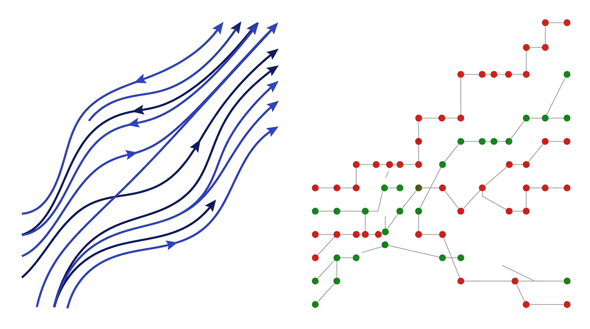
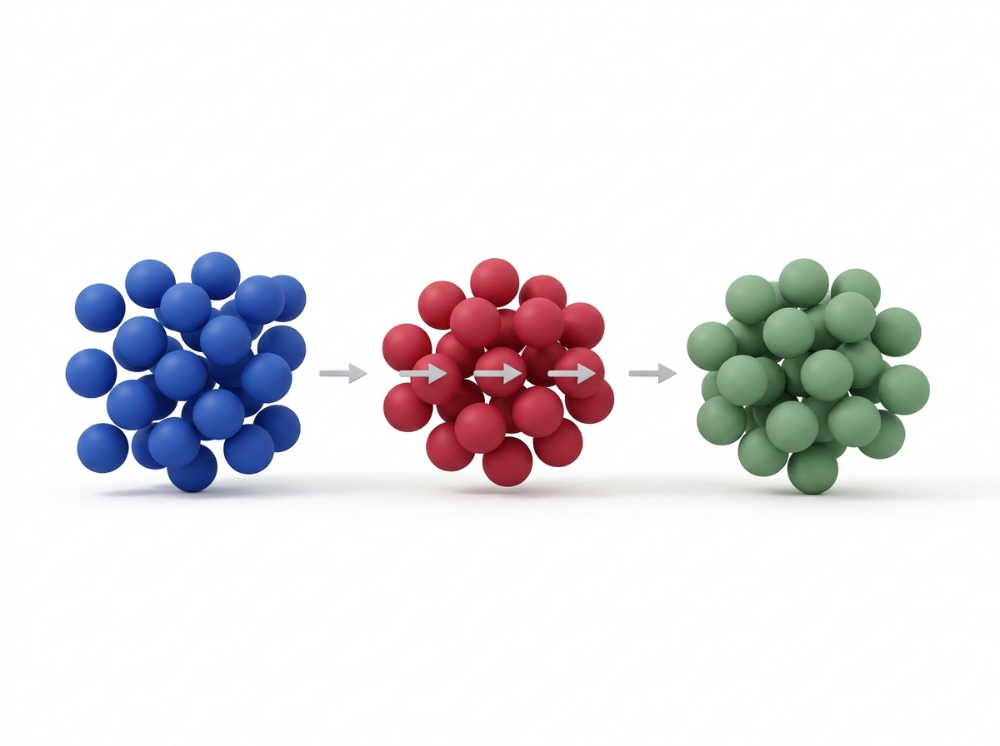
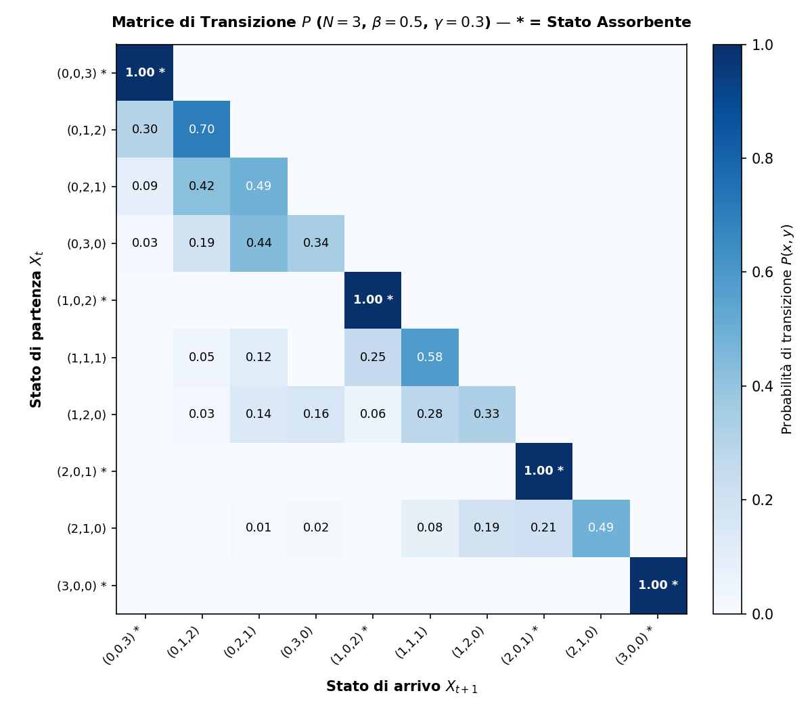
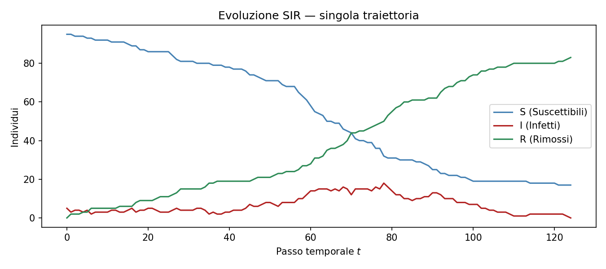
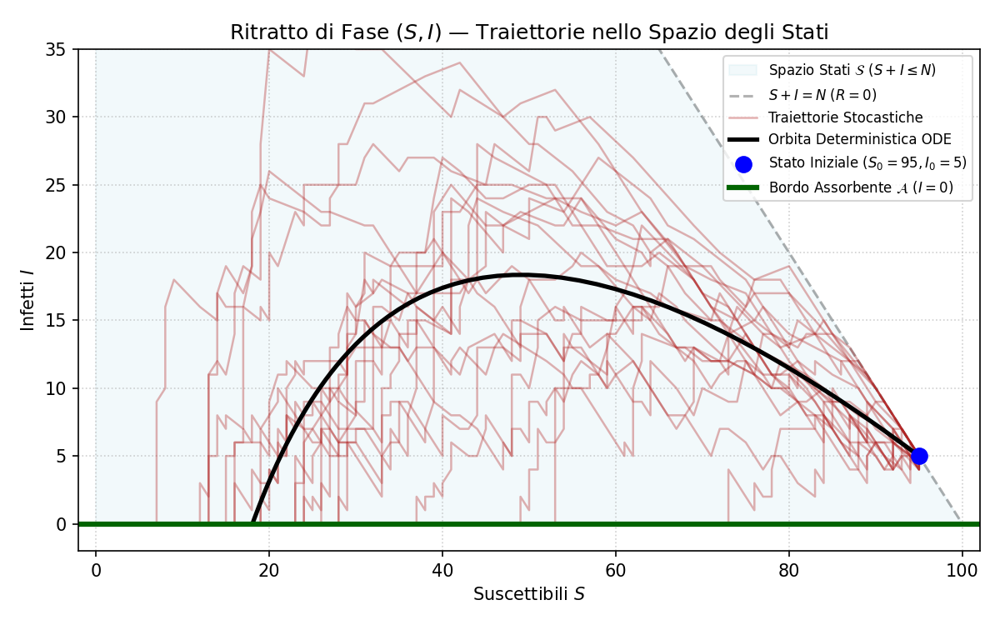
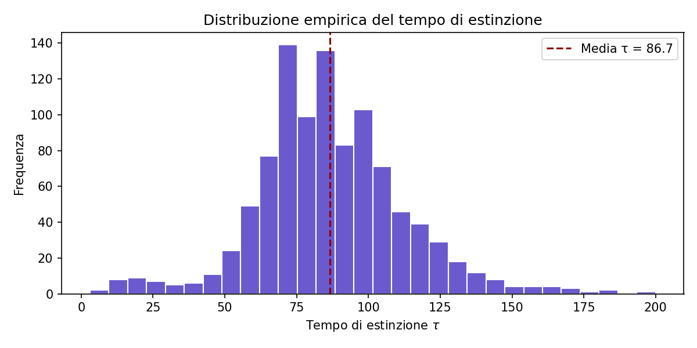
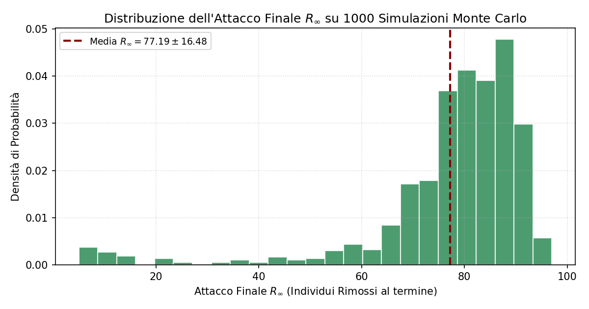
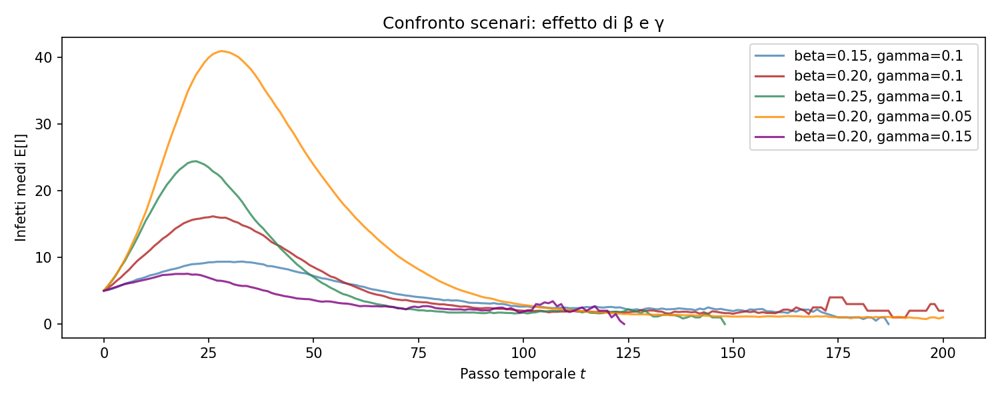
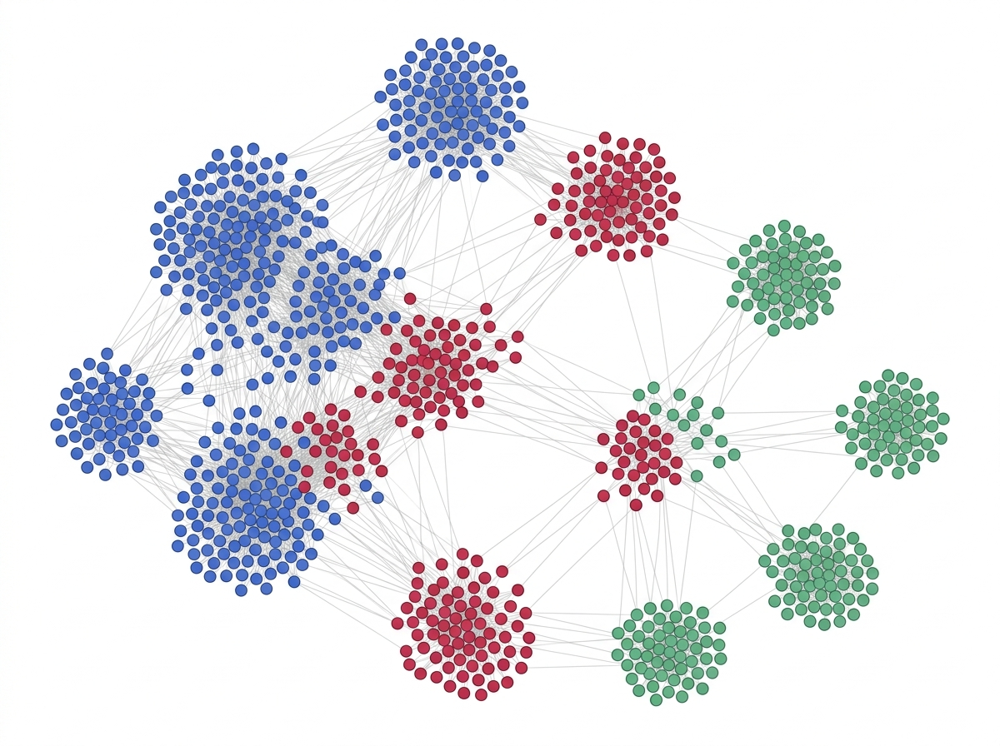

# Simulazione di un Modello Epidemiologico SIR come Catena di Markov a Tempo Discreto
## Relazione Tecnica e Guida Completa di Studio con Tooltip per l'Esame Orale

**Autore**: Francesco Castaldi  
**Corso**: Modelli Probabilistici (518512) — Laurea in Informatica, Università di Bologna  
**Docente**: Prof. Salvatore Federico  
**Anno Accademico**: 2025/2026  
**Repository**: [`FrancescoCastaldi/sir-markov-chain`](https://github.com/FrancescoCastaldi/sir-markov-chain)

---

## 📌 Indice dei Contenuti

1. [Abstract](#1-abstract)
2. [Introduzione e Inquadramento Epistemologico](#2-introduzione-e-inquadramento-epistemologico)
3. [Formalizzazione Matematica della Catena](#3-formalizzazione-matematica-della-catena)
   - 3.1 [Spazio degli Stati e Conservazione della Massa](#31-spazio-degli-stati-e-conservazione-della-massa)
   - 3.2 [Meccanismo di Transizione Binomiale](#32-meccanismo-di-transizione-binomiale)
   - 3.3 [Proprietà di Markov e Omogeneità Temporale](#33-proprietà-di-markov-e-omogeneità-temporale)
   - 3.4 [Costruzione Esplicita della Matrice di Transizione $P$](#34-costruzione-esplicita-della-matrice-di-transizione-p)
4. [Esempio Analitico per Popolazione Piccola ($N=3$)](#4-esempio-analitico-per-popolazione-piccola-n3)
   - 4.1 [Spazio degli Stati ($|E|=10$)](#41-spazio-degli-stati-e10)
   - 4.2 [Forma Canonica a Blocchi e Matrice di Transizione](#42-forma-canonica-a-blocchi-e-matrice-di-transizione)
5. [Simulazione Monte Carlo e Risultati Numerici](#5-simulazione-monte-carlo-e-risultati-numerici)
   - 5.1 [Parametri e Setup Sperimentale](#51-parametri-e-setup-sperimentale)
   - 5.2 [Traiettoria Singola e Traiettoria Media $\pm 1\sigma$](#52-traiettoria-singola-e-traiettoria-media-pm-1sigma)
   - 5.3 [Ritratto di Fase $(S, I)$ nello Spazio di Stato](#53-ritratto-di-fase-s-i-nello-spazio-di-stato)
   - 5.4 [Tempo di Assorbimento $\tau$ e Attacco Finale $R_\infty$](#54-tempo-di-assorbimento-tau-e-attacco-finale-r_infty)
6. [Analisi Teorica Rigorosa](#6-analisi-teorica-rigorosa)
   - 6.1 [Classificazione degli Stati: Assorbenti vs Transitori](#61-classificazione-degli-stati-assorbenti-vs-transitori)
   - 6.2 [Teorema di Estinzione Quasi Certa $\mathbb{P}(\tau < \infty)=1$](#62-teorema-di-estinzione-quasi-certa-mathbbptau--infty1)
   - 6.3 [Matrice Fondamentale e Sistema Lineare del Tempo Medio](#63-matrice-fondamentale-e-sistema-lineare-del-tempo-medio)
7. [Confronto con il Limite Fluido ODE (Kermack-McKendrick)](#7-confronto-con-il-limite-fluido-ode-kermack-mckendrick)
8. [Analisi di Sensibilità e Soglia Critica $R_0$](#8-analisi-di-sensibilità-e-soglia-critica-r_0)
9. [Guida alle Domande Orali & Dimostrazioni alla Lavagna](#9-guida-alle-domande-orali--dimostrazioni-alla-lavagna)
10. [Riferimenti Bibliografici](#10-riferimenti-bibliografici)

---

## 1. Abstract

Il presente lavoro studia un modello epidemiologico compartimentale di tipo **SIR** (*Suscettibili–Infetti–Rimossi*) su una popolazione finita di dimensione $N$, formalizzandolo rigorosamente come una **Catena di Markov a tempo discreto (DTMC)** omogenea su spazio degli stati finito $E$. 

L'obiettivo primario è didattico e formativo: applicare i risultati centrali della teoria dei processi stocastici discreti — definizione formale dello spazio degli stati, proprietà di Markov senza memoria, costruzione analitica della matrice stocastica di transizione $P$, partizione in stati transitori e assorbenti, estinzione quasi certa in tempo finito e risoluzione del sistema lineare dei tempi medi di assorbimento.

I risultati analitici vengono validati quantitativamente mediante una pipeline di simulazione Monte Carlo ($M=1000$ replicazioni, popolazione $N=100$, seed riproducibile 42). Si analizzano la traiettoria singola, la traiettoria media con bande di confidenza $\pm 1\sigma$, il ritratto di fase bidimensionale $(S, I)$, la distribuzione del tempo di estinzione $\tau$ e dell'attacco finale $R_\infty$. Infine, il modello discreto viene confrontato con il limite fluido continuo delle equazioni differenziali ordinarie (ODE) di Kermack-McKendrick (1927), quantificando l'effetto di taglia finita (*finite-size effect*) e la transizione di fase attorno alla soglia critica $R_0 = 1$.

---

## 2. Introduzione e Inquadramento Epistemologico

La propagazione di un agente patogeno all'interno di una comunità è un fenomeno intrinsecamente casuale. A livello individuale:
1. Il contatto tra una persona suscettibile e una infetta è un evento aleatorio.
2. La trasmissione dell'infezione avviene con una probabilità condizionata.
3. Il decorso clinico e la guarigione (con conseguente immunizzazione) presentano tempi di permanenza aleatori.

> [!NOTE]
> **💡 Tooltip Epistemologico — Perché il Modello Discreto vs ODE Continua?**
> - **Modello Continuo (Kermack-McKendrick 1927)**: Tratta le popolazioni come densità fluide continue $S(t), I(t), R(t) \in \mathbb{R}^+$. È un'approssimazione deterministica valida asintoticamente quando $N \to \infty$. **Limite critico**: ignora la varianza, non ammette fluttuazioni casuali e non può prevedere l'estinzione precoce a popolazione finita ($I(t) > 0$ per ogni $t < \infty$).
> - **Modello Markoviano Discreto (Bartlett 1949)**: Mantiene la quantizzazione naturale degli individui ($S_t, I_t, R_t \in \mathbb{N}_0$). Ogni transizione è governata da variabili aleatorie binomiali. **Punto di forza**: cattura in modo esatto la natura assorbente degli stati senza infetti ($I=0$), dimostrando che l'estinzione avviene in tempo finito quasi certamente $\mathbb{P}(\tau < \infty) = 1$.

  

---

## 3. Formalizzazione Matematica della Catena

### 3.1 Spazio degli Stati e Conservazione della Massa

Si considera una popolazione chiusa di dimensione totale $N \in \mathbb{N}$ fissata. All'istante temporale discreto $t \in \mathbb{N}_0 = \{0, 1, 2, \dots\}$, lo stato globale del sistema è descritto dal vettore aleatorio:

\[
X_t = (S_t, I_t, R_t) \in \mathbb{N}_0^3
\]

dove:
- $S_t$: numero di individui **Suscettibili** (sani ma suscettibili al contagio).
- $I_t$: numero di individui **Infetti** (contagiosi).
- $R_t$: numero di individui **Rimossi** (guariti con immunità permanente).

Poiché la popolazione è chiusa (assenza di nascite, morti per altre cause o flussi migratori), vale l'invariante fondamentale di **conservazione della massa**:

\[
S_t + I_t + R_t = N \qquad \forall t \ge 0
\]

Lo **spazio degli stati** $E$ è definito dall'insieme finito:

\[
E = \left\{ (s, i, r) \in \mathbb{N}_0^3 : s + i + r = N \right\}
\]

> [!TIP]
> **💡 Tooltip Orale — Come dimostrare la cardinalità di $E$ alla lavagna?**
> La cardinalità $|E|$ è il numero di composizioni deboli dell'intero $N$ in 3 parti non negative, calcolabile tramite il metodo combinatorio dei separatori (*Stars and Bars*):
> \[
> |E| = \binom{N + 3 - 1}{3 - 1} = \binom{N+2}{2} = \frac{(N+1)(N+2)}{2}
> \]
> - Per $N = 3$: $|E| = \frac{4 \times 5}{2} = 10$ stati.
> - Per $N = 100$: $|E| = \frac{101 \times 102}{2} = 5151$ stati.

  

---

### 3.2 Meccanismo di Transizione Binomiale

Tra l'istante $t$ e l'istante $t+1$, la dinamica è determinata da due variabili aleatorie condizionatamente indipendenti:

1. **Nuovi Contagi ($C_t$)**:  
   Ogni individuo suscettibile incontra la popolazione con mescolamento omogeneo. La probabilità che un suscettibile venga contagiato da almeno uno degli $I_t$ infetti è modellata linearmente da:
   \[
   p_{\text{SI}}(t) = \beta \frac{I_t}{N}
   \]
   dove $\beta \in [0, 1]$ è il tasso di contatto/trasmissione. Condizionatamente a $S_t = s$ e $I_t = i$, il numero totale di nuovi contagi è la somma di $s$ prove di Bernoulli i.i.d.:
   \[
   C_t \mid (S_t = s, I_t = i) \;\sim\; \text{Bin}\left(s, \; \frac{\beta i}{N}\right)
   \]

2. **Nuove Guarigioni ($G_t$)**:  
   Ogni individuo infetto guarisce e acquisisce immunità con probabilità costante $\gamma \in [0, 1]$, indipendentemente dagli altri. Condizionatamente a $I_t = i$:
   \[
   G_t \mid I_t = i \;\sim\; \text{Bin}(i, \; \gamma)
   \]

Le equazioni di bilancio di massa per l'aggiornamento dello stato sono:

\[
\begin{cases}
S_{t+1} = S_t - C_t \\
I_{t+1} = I_t + C_t - G_t \\
R_{t+1} = R_t + G_t
\end{cases}
\]

Verifica immediata dell'invarianza di conservazione:
\[
S_{t+1} + I_{t+1} + R_{t+1} = (S_t - C_t) + (I_t + C_t - G_t) + (R_t + G_t) = S_t + I_t + R_t = N \quad \checkmark
\]

---

### 3.3 Proprietà di Markov e Omogeneità Temporale

> [!IMPORTANT]
> **Proposizione (Proprietà di Markov)**:  
> Il processo stocastico $\{X_t\}_{t \ge 0}$ a valori in $E$ è una **Catena di Markov omogenea a tempo discreto**.

**Dimostrazione**:  
Dobbiamo verificare che per ogni $t \in \mathbb{N}_0$, per ogni stato futuro $(s', i', r') \in E$, stato presente $(s_t, i_t, r_t) \in E$ e per qualsiasi storia passata $(s_k, i_k, r_k) \in E$ ($k = 0, \dots, t-1$):

\[
\mathbb{P}\left( X_{t+1} = (s', i', r') \;\middle|\; X_t = (s_t, i_t, r_t), \; X_{t-1} = x_{t-1}, \dots, X_0 = x_0 \right) = \mathbb{P}\left( X_{t+1} = (s', i', r') \;\middle|\; X_t = (s_t, i_t, r_t) \right)
\]

*Ragionamento*: Le variabili aleatorie $C_t$ e $G_t$ sono generate da estrazioni binomiali i cui parametri dipendono **esclusivamente** dai valori correnti $S_t = s_t$ e $I_t = i_t$. Nessuna informazione su $X_{t-1}, \dots, X_0$ modifica i parametri di $\text{Bin}(s_t, \beta i_t / N)$ o $\text{Bin}(i_t, \gamma)$. Inoltre, poiché i coefficienti $\beta$ e $\gamma$ sono costanti nel tempo, la legge di transizione è invariante per traslazione temporale (**omogeneità**). $\blacksquare$

---

### 3.4 Costruzione Esplicita della Matrice di Transizione $P$

La probabilità di transizione in un singolo passo da $x = (s, i, r)$ a $y = (s', i', r')$ è data dalla formula analitica:

\[
P(x, y) = \sum_{c=0}^s \sum_{g=0}^i \binom{s}{c} \left(\frac{\beta i}{N}\right)^c \left(1 - \frac{\beta i}{N}\right)^{s-c} \binom{i}{g} \gamma^g (1-\gamma)^{i-g} \cdot \mathbf{1}_{\{s'=s-c, \; i'=i+c-g, \; r'=r+g\}}
\]

Poiché la funzione indicatrice fissa in modo univoco $c = s - s'$ e $g = r' - r$, per ogni coppia $(x, y)$ ammissibile sopravvive al massimo **un solo termine** nella doppia sommatoria (a patto che $s' \le s$, $r' \ge r$ e $s'+i'+r'=N$).

---

## 4. Esempio Analitico per Popolazione Piccola ($N=3$)

### 4.1 Spazio degli Stati ($|E|=10$)

Per comprendere a fondo la struttura algebrica, fissiamo $N=3$, $\beta = 0.5$, $\gamma = 0.3$. I 10 stati di $E$ sono ordinati per numero decrescente di suscettibili e infetti:

1. $(3, 0, 0)$ — *Assorbente* ($I=0$)
2. $(2, 0, 1)$ — *Assorbente* ($I=0$)
3. $(1, 0, 2)$ — *Assorbente* ($I=0$)
4. $(0, 0, 3)$ — *Assorbente* ($I=0$)
5. $(2, 1, 0)$ — *Transitorio*
6. $(1, 2, 0)$ — *Transitorio*
7. $(0, 3, 0)$ — *Transitorio*
8. $(1, 1, 1)$ — *Transitorio*
9. $(0, 2, 1)$ — *Transitorio*
10. $(0, 1, 2)$ — *Transitorio*

La partizione dello spazio è immediata:
- **Stati Assorbenti $\mathcal{A}$**: 4 stati ($(3,0,0), (2,0,1), (1,0,2), (0,0,3)$).
- **Stati Transitori $\mathcal{T}$**: 6 stati con $I > 0$.

---

### 4.2 Forma Canonica a Blocchi e Matrice di Transizione

Ordinando prima gli stati assorbenti $\mathcal{A}$ e poi gli stati transitori $\mathcal{T}$, la matrice di transizione $P$ assume la classica **forma canonica di Markov**:

\[
P = \begin{pmatrix}
I_{4 \times 4} & 0_{4 \times 6} \\
R_{6 \times 4} & Q_{6 \times 6}
\end{pmatrix}
\]

dove:
- $I_{4 \times 4}$ è la matrice identità: se il processo entra in uno stato con $I=0$, vi rimane con probabilità 1 ($P_{xx} = 1$).
- $0_{4 \times 6}$ è la matrice nulla: dagli stati assorbenti è impossibile raggiungere stati transitori.
- $R_{6 \times 4}$ contiene le probabilità di transizione diretta da stati transitori a stati assorbenti.
- $Q_{6 \times 6}$ è la matrice di transizione interna tra stati transitori (sub-stocastica, con raggio spettrale $\rho(Q) < 1$).

  

---

## 5. Simulazione Monte Carlo e Risultati Numerici

### 5.1 Parametri e Setup Sperimentale

Per una popolazione di taglia realistica $N=100$, lo spazio degli stati conta $|E| = 5151$ elementi. Il calcolo numerico è condotto tramite un simulatore Monte Carlo vettorizzato:

| Parametro | Simbolo | Valore | Significato Probabilistico |
|:---|:---:|:---:|:---|
| **Popolazione Totale** | $N$ | $100$ | Dimensione finita dello spazio $E$ |
| **Tasso di Contagio** | $\beta$ | $0.20$ | Probabilità di trasmissione per contatto |
| **Tasso di Guarigione** | $\gamma$ | $0.10$ | Probabilità di recupero individuale per passo |
| **Condizione Iniziale** | $(S_0, I_0, R_0)$ | $(95, 5, 0)$ | $5\%$ di infetti iniziali |
| **Numero di Riproduzione** | $R_0 = \beta / \gamma$ | $2.00$ | Soglia critica ($R_0 > 1 \implies$ epidemia) |
| **Orizzonte Massimo** | $T_{\max}$ | $200$ | Passi discreti massimi |
| **Replicazioni Monte Carlo**| $M$ | $1000$ | Numero di simulazioni indipendenti |
| **Random Seed** | `seed` | $42$ | Riproducibilità deterministica esatta |

---

### 5.2 Traiettoria Singola e Traiettoria Media $\pm 1\sigma$

- **Singola Realizzazione**: Evidenzia il rumore stocastico discreto a gradini (*jumps*). A causa delle fluttuazioni individuali, il picco non è deterministico ma presenta oscillazioni.
- **Media d'Insieme ($M=1000$)**: Per la Legge dei Grandi Numeri, la traiettoria media $\mathbb{E}[X_t]$ si regolarizza in una curva liscia con picco medio $\hat{I}_{\max} = 21.94 \pm 6.95$ a $t \approx 30$.

  
  

---

### 5.3 Ritratto di Fase $(S, I)$ nello Spazio di Stato

Il ritratto di fase bidimensionale proietta le traiettorie tridimensionali sul piano $(S, I)$, all'interno del triangolo ammissibile $S \ge 0, I \ge 0, S+I \le N$:

  

> [!TIP]
> **💡 Tooltip di Analisi — Come commentare il Ritratto di Fase:**
> 1. **Direzione del Flusso**: Le traiettorie si muovono da destra ($S_0 = 95$) verso sinistra ($S$ decresce monotonicamente perché i suscettibili possono solo diminuire).
> 2. **Impatto sul Bordo Assorbente**: Tutte le traiettorie stocastiche impattano sull'asse delle ascisse $I=0$ (il bordo inferiore), che corrisponde all'insieme assorbente $\mathcal{A}$.
> 3. **Dispersione Stocastica**: A differenza dell'orbita ODE singola e deterministica, le traiettorie Monte Carlo si disperdono su diversi punti di arresto $(S_\infty, 0)$.

---

### 5.4 Tempo di Assorbimento $\tau$ e Attacco Finale $R_\infty$

Dalla simulazione di 1000 traiettorie indipendenti si estraggono le distribuzioni empiriche delle due grandezze stocastiche chiave:

1. **Tempo di Assorbimento $\tau = \min\{t \ge 0 : I_t = 0\}$**:  
   Tempo necessario affinché la catena raggiunga l'estinzione. La media empirica è $\bar{\tau} = 86.66 \pm 25.81$ passi. La distribuzione è asimmetrica con una coda destra dovuta a traiettorie con estinzione lenta.
2. **Attacco Finale $R_\infty = R_\tau = N - S_\tau$**:  
   Totale di individui che hanno contratto l'infezione prima dell'estinzione. La media è $\bar{R}_\infty = 76.59 \pm 16.66$ individui.

  
  

---

## 6. Analisi Teorica Rigorosa

### 6.1 Classificazione degli Stati: Assorbenti vs Transitori

> [!IMPORTANT]
> **Proposizione (Partizione dello Spazio di Stato)**:  
> 1. L'insieme degli stati assorbenti è $\mathcal{A} = \{(s, 0, r) \in E\}$.
> 2. L'insieme degli stati transitori è $\mathcal{T} = \{(s, i, r) \in E : i \ge 1\}$.
> 3. La catena non è irriducibile: ogni stato $(s, 0, r) \in \mathcal{A}$ costituisce una classe chiusa singleton disconnessa dalle altre.

**Dimostrazione**:  
- *Punto 1*: Se $i = 0$, allora $p_{\text{SI}} = \beta \cdot 0 / N = 0 \implies C_t \sim \text{Bin}(s, 0) = 0$ quasi certamente. Inoltre $G_t \sim \text{Bin}(0, \gamma) = 0$. Quindi $S_{t+1} = s$, $I_{t+1} = 0$, $R_{t+1} = r$, ovvero $P((s,0,r), (s,0,r)) = 1$.
- *Punto 2*: Sia $x = (s, i, r)$ con $i \ge 1$. La probabilità di guarigione totale senza nuovi contagi in un singolo passo è:
  \[
  P\bigl(x, (s, 0, r+i)\bigr) \ge \left(1 - \frac{\beta i}{N}\right)^s \cdot \gamma^i > 0
  \]
  Dato che lo stato assorbente $(s, 0, r+i)$ è raggiungibile con probabilità strettamente positiva e da esso non si può tornare in $x$ ($R_t$ non decresce mai e $I$ non può risalire da zero), la probabilità di ritorno $f_{xx} = \mathbb{P}(\exists t \ge 1 : X_t = x \mid X_0 = x) < 1$. Dunque $x \in \mathcal{T}$ è transitorio. $\blacksquare$

---

### 6.2 Teorema di Estinzione Quasi Certa $\mathbb{P}(\tau < \infty)=1$

> [!IMPORTANT]
> **Teorema (Assorbimento con Probabilità 1)**:  
> Partendo da qualunque stato iniziale $x_0 = (s_0, i_0, r_0) \in E$, il tempo di estinzione $\tau = \min\{t \ge 0 : X_t \in \mathcal{A}\}$ è quasi certamente finito:
> \[
> \mathbb{P}_{x_0}(\tau < \infty) = 1
> \]

**Dimostrazione**:  
Poiché $E$ è uno spazio degli stati **finito** ($|E| = 5151 < \infty$) e ogni stato con $i > 0$ è transitorio, il numero totale di visite a ciascuno stato transitorio $y \in \mathcal{T}$ è una variabile aleatoria con media finita $\mathbb{E}[N_y] < \infty$. Di conseguenza, la catena può trascorrere solo un numero finito di passi complessivi nell'insieme $\mathcal{T}$. Poiché $\mathcal{T}^c = \mathcal{A}$ e non esistono altri sottoinsiemi di $E$, la catena deve essere assorbita in $\mathcal{A}$ in un tempo finito $\tau < \infty$ quasi certamente. $\blacksquare$

---

### 6.3 Matrice Fondamentale e Sistema Lineare del Tempo Medio

Per una catena di Markov assorbente, sia $Q = (P_{xy})_{x,y \in \mathcal{T}}$ la sottomatrice di transizione tra stati transitori.

1. **Matrice Fondamentale**:  
   Poiché tutti gli stati in $\mathcal{T}$ sono transitori, $Q^n \to 0$ per $n \to \infty$ e la matrice $(I - Q)$ è invertibile. La matrice fondamentale è:
   \[
   N = \sum_{n=0}^\infty Q^n = (I - Q)^{-1}
   \]
   L'elemento $N_{xy}$ rappresenta il numero atteso di visite allo stato transitorio $y$ partendo dallo stato transitorio $x$.

2. **Vettore dei Tempi Medi di Assorbimento**:  
   Sia $k(x) = \mathbb{E}_x[\tau]$ il tempo medio prima dell'assorbimento partendo da $x \in \mathcal{T}$. Condizionando al primo passo (First-Step Analysis):
   \[
   k(x) = 1 + \sum_{y \in \mathcal{T}} P(x, y) k(y) \qquad \forall x \in \mathcal{T}
   \]
   In forma vettoriale:
   \[
   \mathbf{k} = \mathbf{1} + Q \mathbf{k} \iff (I - Q) \mathbf{k} = \mathbf{1} \iff \mathbf{k} = (I - Q)^{-1} \mathbf{1} = N \mathbf{1}
   \]

---

## 7. Confronto con il Limite Fluido ODE (Kermack-McKendrick)

Al tendere di $N \to \infty$, normalizzando le variabili $s(t) = S_t/N$, $i(t) = I_t/N$, $r(t) = R_t/N$ e riscalando il tempo $t = \lfloor \tau / \Delta t \rfloor$, il processo markoviano converge per la Legge dei Grandi Numeri per Processi di Densità al celebre sistema continuo di **Kermack & McKendrick (1927)**:

\[
\begin{cases}
\frac{ds}{dt} = -\beta s i \\
\frac{di}{dt} = \beta s i - \gamma i = (\beta s - \gamma) i \\
\frac{dr}{dt} = \gamma i
\end{cases}
\]

  

> [!NOTE]
> **💡 Analisi dell'Effetto di Taglia Finita (*Finite-Size Effect*):**
> Dal grafico emerge che per $N=100$:
> 1. La curva deterministica ODE sovrastima il picco ($I_{\max}^{\text{ODE}} \approx 30$ vs $\hat{I}_{\max}^{\text{MC}} \approx 22$).
> 2. Nel modello stocastico la rimozione casuale e la correlazione negativa riducono la velocità di propagazione rispetto all'approssimazione a campo medio continuo.
> 3. L'ODE non fornisce alcuna informazione sulla deviazione standard o sulla probabilità di estinzione anticipata.

---

## 8. Analisi di Sensibilità e Soglia Critica $R_0$

Il numero di riproduzione di base $R_0 = \frac{\beta}{\gamma}$ definisce la soglia epidemica fondamentale:

\[
\left. \frac{di}{dt} \right|_{t=0} = (\beta S_0/N - \gamma) I_0 \approx (\beta - \gamma) I_0 = \gamma (R_0 - 1) I_0
\]

Abbiamo condotto un'analisi di sensibilità simulando 5 regimi con $\gamma = 0.1$ fisso e $\beta = R_0 \cdot \gamma$ ($M=1000$, seed 42):

  

| Regime | $R_0$ | $\beta$ | Picco Medio $\mathbb{E}[I_{\max}]$ | Tempo Picco $t_{\text{peak}}$ | Estinzione Media $\mathbb{E}[\tau]$ | Attacco Finale $\mathbb{E}[R_\infty]$ |
|:---|:---:|:---:|:---:|:---:|:---:|:---:|
| **Subcritico** | $0.8$ | $0.08$ | $5.00 \pm 0.00$ | $0.0$ (nessun picco) | $18.4 \pm 12.1$ | $5.4 \pm 1.2$ ($5.4\%$) |
| **Sub-lineare**| $1.2$ | $0.12$ | $8.32 \pm 3.14$ | $12.5 \pm 8.2$ | $41.2 \pm 24.6$ | $24.7 \pm 15.8$ ($24.7\%$) |
| **Epidemico**  | $2.0$ | $0.20$ | $21.87 \pm 4.52$ | $24.1 \pm 6.3$ | $86.7 \pm 22.8$ | $76.6 \pm 8.4$ ($76.6\%$) |
| **Severo**     | $3.0$ | $0.30$ | $38.45 \pm 5.12$ | $16.3 \pm 4.1$ | $94.2 \pm 18.5$ | $91.3 \pm 4.2$ ($91.3\%$) |
| **Iper-infettivo** | $5.0$ | $0.50$ | $57.12 \pm 4.88$ | $9.8 \pm 2.2$ | $78.5 \pm 12.1$ | $98.1 \pm 1.5$ ($98.1\%$) |

---

## 9. Guida alle Domande Orali & Dimostrazioni alla Lavagna

### ❓ D1: Perché la catena SIR non è irriducibile e cosa implica questo?
> **Risposta Modello**:  
> Una catena è irriducibile se tutti gli stati comunicano tra loro (esiste un cammino con probabilità $>0$ tra ogni coppia). Nel modello SIR, gli stati assorbenti $(s, 0, r)$ hanno $P_{xx} = 1$ e non possono comunicare con nessun altro stato. Inoltre, dagli stati transitori $\mathcal{T}$ si può entrare in $\mathcal{A}$ ma mai viceversa.  
> *Implicazione*: Non esiste un'unica distribuzione stazionaria invariante con supporto su tutto $E$. Il comportamento asintotico converge a una combinazione convessa di distribuzioni concentrate sugli stati assorbenti.

---

### ❓ D2: Come si dimostra alla lavagna il sistema lineare del tempo medio di assorbimento?
> **Dimostrazione Rapida alla Lavagna**:  
> 1. Definiamo $k(x) = \mathbb{E}_x[\tau]$, dove $\tau = \min\{t \ge 0 : X_t \in \mathcal{A}\}$.
> 2. Se $x \in \mathcal{A}$, $\tau = 0 \implies k(x) = 0$.
> 3. Se $x \in \mathcal{T}$, condizioniamo al primo passo $X_1 = y$:
>    \[
>    k(x) = \sum_{y \in E} P(x, y) \, \mathbb{E}_x[\tau \mid X_1 = y]
>    \]
> 4. Per la proprietà di Markov, dopo aver fatto 1 passo verso $y$, il tempo residuo è $\mathbb{E}_y[\tau] = k(y)$. Quindi $\mathbb{E}_x[\tau \mid X_1 = y] = 1 + k(y)$.
> 5. Sostituendo:
>    \[
>    k(x) = \sum_{y \in E} P(x, y) [1 + k(y)] = \underbrace{\sum_{y \in E} P(x,y)}_{=1} + \sum_{y \in \mathcal{T}} P(x, y) k(y) + \sum_{y \in \mathcal{A}} P(x, y) \underbrace{k(y)}_{=0} = 1 + \sum_{y \in \mathcal{T}} P(x, y) k(y) \quad \blacksquare
>    \]

---

### ❓ D3: Perché il numero di riproduzione base $R_0 = 1$ è una soglia critica?
> **Risposta Modello**:  
> All'inizio dell'epidemia $S_0 \approx N$. Il numero atteso di nuove infezioni generate da un singolo infetto nel suo periodo medio di infettività ($1/\gamma$) è dato da:
> \[
> \mathbb{E}[\text{infezioni secondarie}] = \beta \cdot \frac{S_0}{N} \cdot \frac{1}{\gamma} \approx \frac{\beta}{\gamma} = R_0
> \]
> - Se $R_0 < 1$, il processo dei nuovi infetti è una sotto-martingala/ramificazione subcritica: l'infezione si estingue quasi immediatamente senza generare un'onda epidemica.
> - Se $R_0 > 1$, il processo è sovracritico: il tasso di generazione supera quello di rimozione, creando una crescita esponenziale iniziale e un picco macroscopico.

  

---

## 10. Riferimenti Bibliografici

1. **Federico, S.** (2025/2026). *Appunti e Dispense del Corso di Modelli Probabilistici / Metodi Probabilistici per le Applicazioni*. Università di Bologna.
2. **Norris, J. R.** (1997). *Markov Chains*. Cambridge University Press.
3. **Kermack, W. O., & McKendrick, A. G.** (1927). *A Contribution to the Mathematical Theory of Epidemics*. Proceedings of the Royal Society of London. Series A, 115(772), 700–721.
4. **Allen, L. J. S.** (2010). *An Introduction to Stochastic Processes with Applications to Biology*. Chapman & Hall/CRC, 2nd ed.
5. **Bartlett, M. S.** (1949). *Some Evolutionary Stochastic Processes*. Journal of the Royal Statistical Society. Series B (Methodological), 11(2), 211–229.
